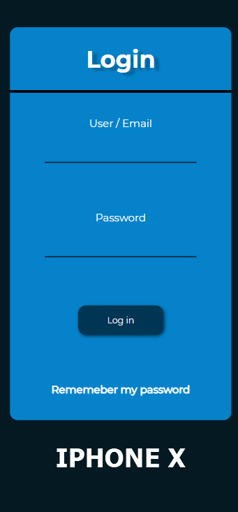
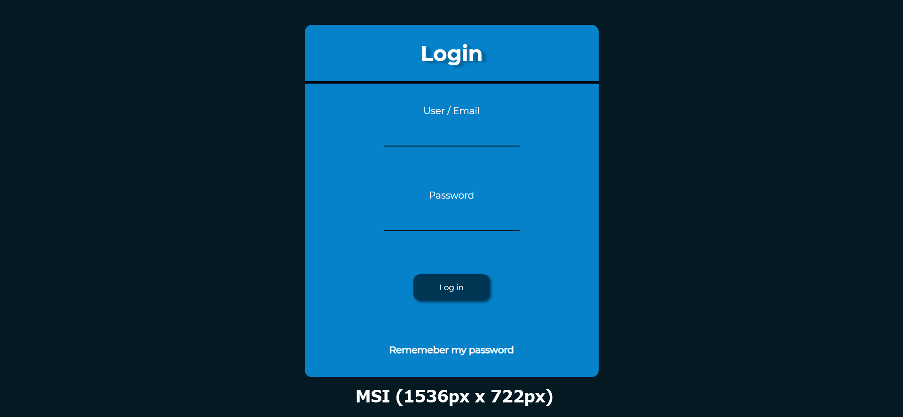
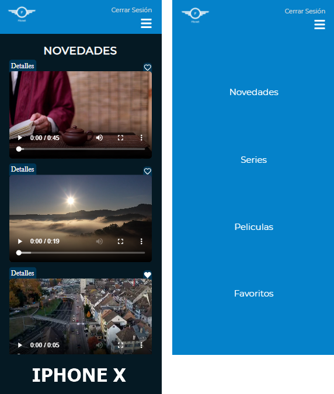
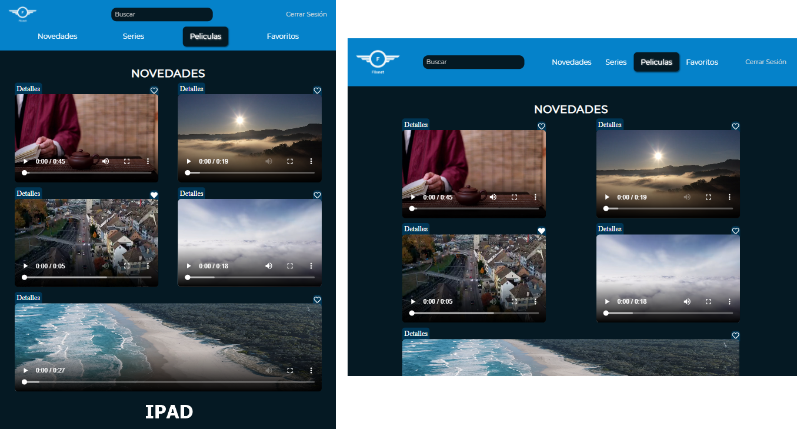
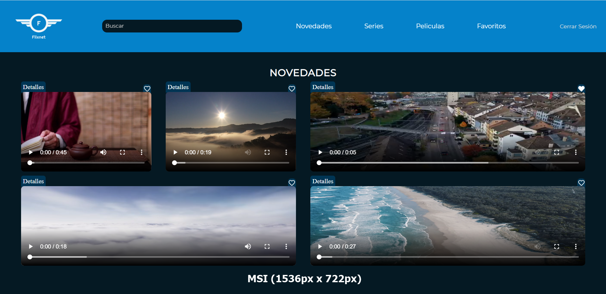
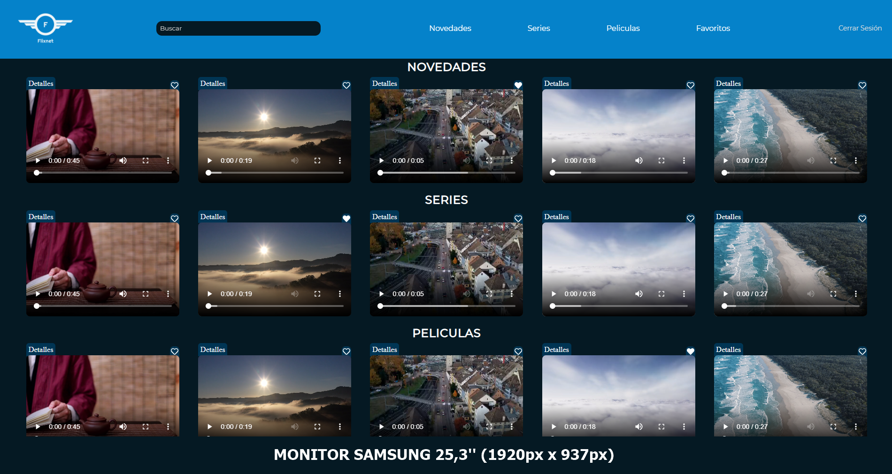
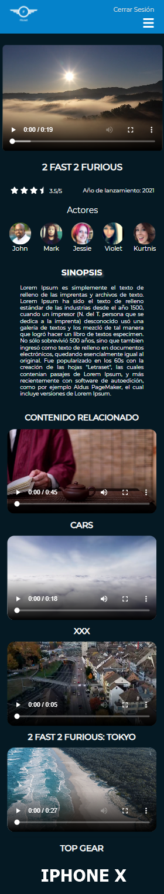
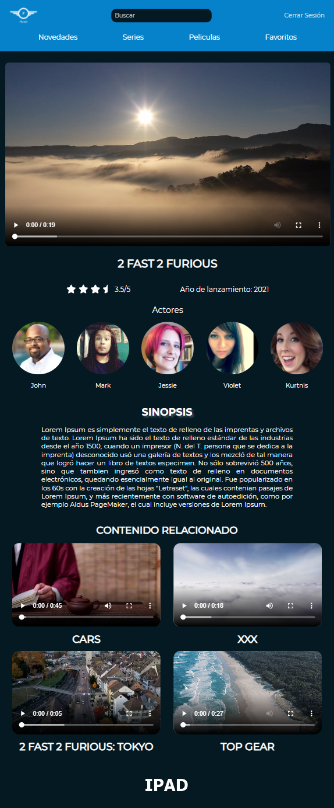
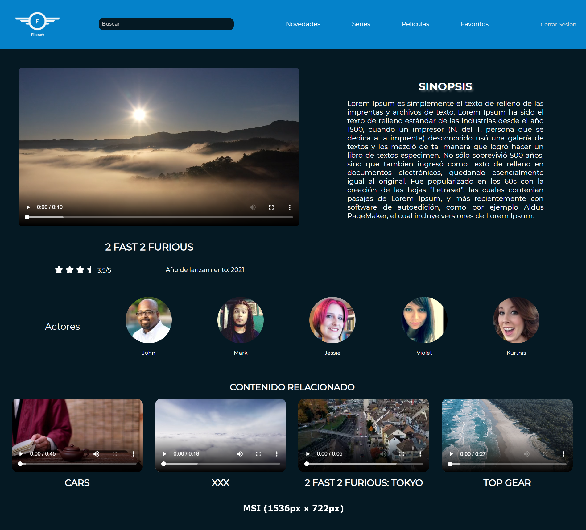
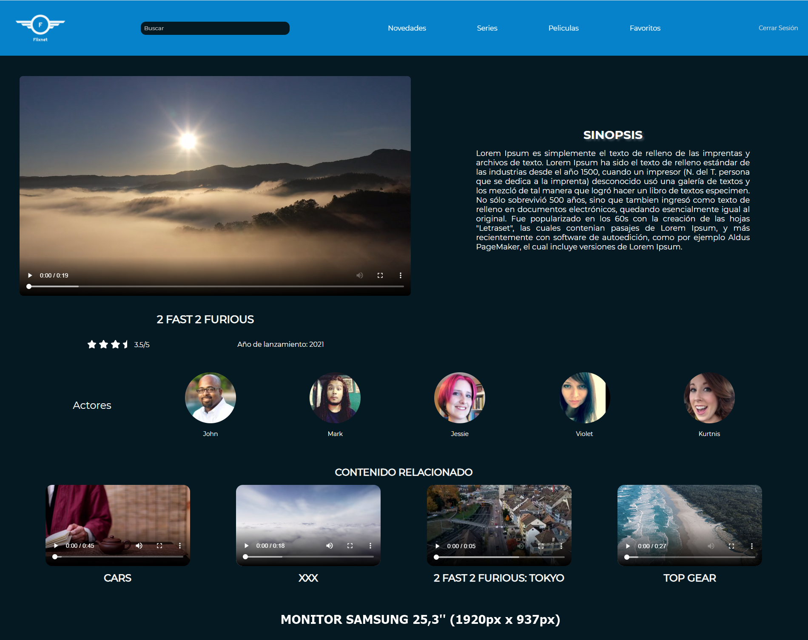

# PRÁCTICA FUNDAMENTOS BÁSICOS DE HTML5 Y CSS3

---

- Primera práctica del bootcamp **FullStack Web Developer** de **KEEPCODING**

- Para la siguiente práctica, se ha usado:

  - HTML5
  - CSS3

- Y los complementos, tales como, iconos, imagenes, videos, han sido extraídos de:

  - [Fontawesome](https://fontawesome.com/)
  - [Pixabay](https://pixabay.com/es/)
  - [Random User Generator](https://randomuser.me/photos)

## PREVISUALIZACIÓN

---

### **_INDEX.HTML_**

### **MAIN.HTML**

### **DETAILS.HTML**

